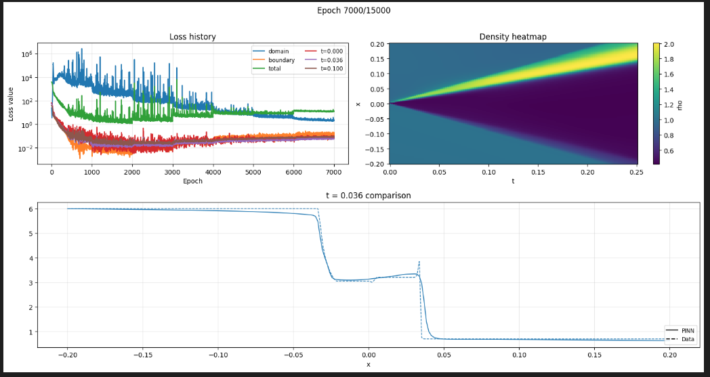
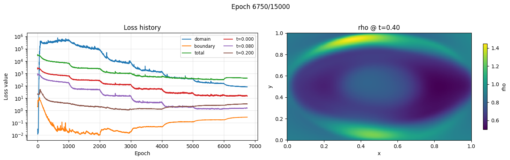
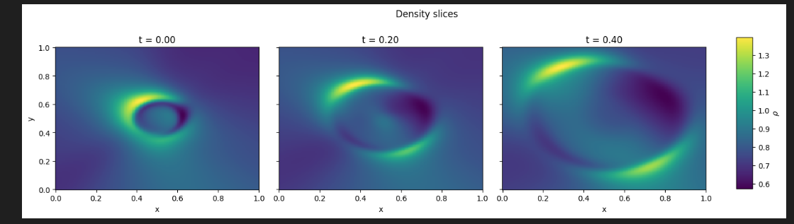
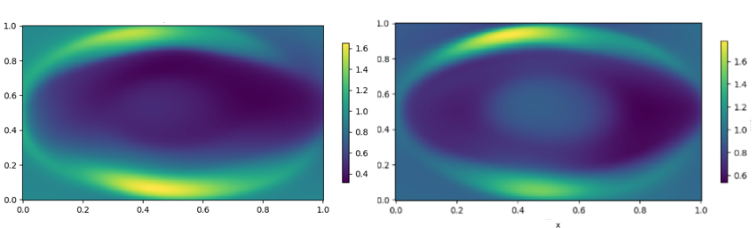
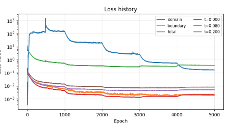
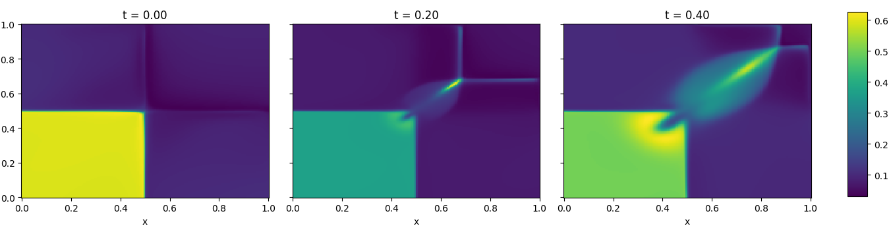
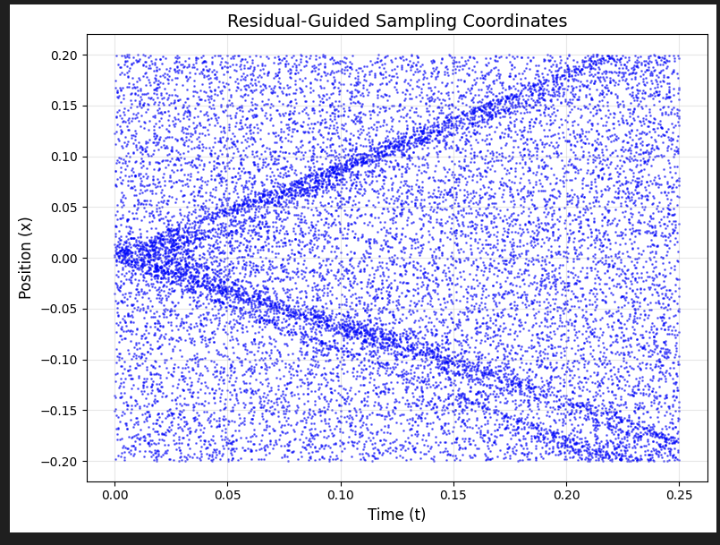

# Reconstructing RMHD from Physics Informed Neural Networks

Authors: Corwin Cheung, Marcos Jonhson-Noya, Michael Xiang, Dominic Chang and Alfredo Guevara

A research code (`rmhdpinn.ipynb`) that implements physics-informed neural networks (PINNs) for relativistic magnetohydrodynamics (RMHD). Instead of advancing the standard conservative form, the workflow relies on Jacobians of the primitive-variable system (`M`, `AX`, source terms) to measure how well a neural surrogate satisfies the PDEs. The notebook first trains a baseline PINN, then iteratively learns residual-correction networks using stored Jacobian operators.

## Table of Contents
- [RMHD](#RMHD)
- [Overview](#overview)
- [Physics Background](#physics-background)
- [Notebook Workflow](#notebook-workflow)
- [Repository Structure](#repository-structure)
- [Prerequisites](#prerequisites)
- [Running the Notebook](#running-the-notebook)
- [Extending the Framework](#extending-the-framework)
- [References](#references)

## RMHD

Relativistic magnetohydrodynamics (RMHD) describes a conducting fluid coupled to electromagnetic fields in a relativistic setting. It is a generalization of more standard MHD in plasma physics and a preamble to the full-fledged GR-MHD modelling of black hole accretion.

As in the full GRMHD setup, the governing equations follow from stress--energy conservation, current conservation, and Maxwell (We will further assume the ideal-MHD condition $F^{\mu\nu}u_\nu=0$.). These form a first order coupled PDE system. For their numerical implementation it is usually written in the conservative scheme:

$$ \partial_t U(P) + \partial_i J^i(P) = 0 $$ 

for functions of the primitives $P=(\rho_0,p_0,u^\mu,B^\mu)$. A numerical integrator would typically perform 

1) time step to update $U(P)$ (primitive function)
2) The numerical inversion $P=P(U)$, a trascendental function highly sensitive to the background
3) Evaluate the current divergence $\partial_i J^i(P)$ via finite differences or finite elements and repeat step 1.

For purposes of training we find it more convenient to expose the linear structure of the equation (*), by casting it as

$$ M \partial_t P + A^i \partial_i P = 0 $$ 

where the Jacobians $M=\partial U/\partial P$ and $A^i=\partial J^i/\partial P$ encode the characteristic structure. Indeed, linearizing around a homogeneous background $(\rho_0,p_0,u^\mu_0,B^\mu_0)$ yields a first-order system

$$ M \partial_t \delta P  + A^i \partial_i \delta P = 0$$ 

The eigenvalues of $M^{-1} A^i n_i$ give the wave speeds along direction $n_i$. For instance, Alfvén waves emerge as the transverse, incompressible characteristic family. In RMHD their propagation speed is

$$v_A^2 = \frac{b^2}{b^2 + h}$$

with $b^2$ the magnetic-field energy density in the fluid frame and $h=\rho_0+p_0+\varepsilon_0$ the enthalpy. They propagate strictly along the magnetic field, are polarized perpendicular to both $n_i$ and $B_i$, and remain linearly degenerate, making them an essential diagnostic mode of any RMHD linearization.


## Overview of our approach

The goal is to approximate RMHD dynamics with a neural surrogate that respects the governing equations. The neural network (PINN) itself is the map 

$$x^\mu \to NN(x)=P=(\rho_0,p_0,u^\mu,B^\mu)$$.

The loss is constructed to update the weights of the network. It consists of a weighted sum of 

1) the PDE residual obtained from the RMHD equation (in Jacobian form) sampled from random points in the domain
2) fits to available early time simulation data, stored in the folders data1D and data2D, $\mathcal{L}_{\textrm{data}}$
3) fits to open boundary conditions, namely $P(x,t)$ at the boundaries is constant in time.

Schematically: 

$$\mathcal{L}_{\textrm{total}} = w_1 \mathcal{L}_{\textrm{PDE}} + w_2 \mathcal{L}_{\textrm{data}} + w_3 \mathcal{L}_{\textrm{bdy}}$$

see [1] for more details about physically informed networks.

## Architecture and training

The architecture is a standard MLP with different sizes for tests in one and two dimensions. In 1D we use approximately 64 layers of width 32. In 2D we use approximately 128 layers of width 64. Activations are set as trainable hyperbolic tangent. 

A key ingredient to improve convergence of the PDE loss is the implementation of MUON optimizer [2]. MUON allows for rapid training of the previously simulated data during the first ~1000 epochs. We then gradually increase the PDE weight for around ~10000 epochs. *The data is only inocorporated through two snapshots at early times*.  On the other hand, the sampling proceeds by increments of ~500 samples from the domain every 1000 epochs, while data sampling is decreased accordingly. 

A typical training process for 1d will look as follows:




Here the data is supplied at early times `t = 0.0, 0.036, 0.1`. The network provides an accurate extrapolawtion of the shockwave 1d process. This is true even at late times where no data is provided. 

For 2d and the above described network we test a cylindrical explosion process.





A crucial ingredient in this test is the augmentation of the PDE system by an extra spatial constraing, the divergence free condition

$\partial_i B^i =  0 $ 

which is imposed by the PDE but often violated in time evolution. The correction resolves the internal shock in the explostion test. See below for comparison.


<p align="center">

Another test involves the generation of a 2d shock in relativistic hydrodynamics. This simpler setup leads to rapid convergence and sharp resolution.

<p align="center"></p>



## Optional: Residual Network

Once the model has finished training we can evaluate the domain residual at random points. We model a new density of samples according to such residual. For instance in the 1D shocktube we will obtain:




With such samples we can train successive "residual" networks (`model_residual`) that learn to cancel the PDE violations of the latest solution (`model`). 

At each collocation point we evaluate a new network for the state $\delta\mathbf{p}(x,t)$. This is an Alfven-like perturbation of the system and sastisfies the linearized PDE

$$
M(\mathbf{p}) \partial_t \delta\mathbf{p} + A_x(\mathbf{p}) \partial_x \delta\mathbf{p} + S(\mathbf{p}) \delta\mathbf{p} = \mathcal{R}(\mathbf{p}) ,
$$

where $M$ is the time Jacobian, $A_x$ is the spatial Jacobian, and $S = \partial_t M + \partial_x A_x$ in the background $p$. Recall that during training we computed targets

$$
\mathcal{R}(\mathbf{p}) = M  \partial_t \mathbf{p}
      + A_{x} \partial_x \mathbf{p}
$$

so that we can now train the network for $\delta\mathbf{p}$ to minimize the difference between the above two equations, namely

$$
M(\mathbf{p}) (\partial_t \delta\mathbf{p} - \partial_t p) + A_x(\mathbf{p}) (\partial_x \delta\mathbf{p} - \partial_x p) + S(\mathbf{p}) \delta\mathbf{p} = 0
$$

This is so that the PINN $p - \delta p$ adheres to the Jacobian PDE.


## Notebook Workflow
1. **Train baseline PINN (`model`).** Uses Muon optimizer plus domain/data/boundary losses.
2. **Build Jacobian operators and train `model_residual`.** Residual-guided sampling + stored $(M_r, A_{X,r}, S_r, \partial_t\mathbf{p}_r, \partial_x\mathbf{p}_r)$ define `lin_eq`.
3. **Clean up tensors, recompute operators with `corr(x)`, and test for new error (domain loss).

## Repository Structure
```
RMHD-NN/
├── README.md                # This document
├── RMHDEquations2D.py       # Reference RMHD equations (informative)
├── jacobians.py             # Computes M/AX Jacobians used in the notebook
├── rmhdpinn_1d.ipynb        # 1D PINN workflow
├── rmhdpinn_2d.ipynb        # 2D PINN workflow
├── training.png             # 1D training illustration
├── 2dtrain.png              # 2D training illustration
├── 2dcexp.png               # 2D cylindrical explosion output
└── images/
    └── sun.jpg              # Placeholder/demo image
```

## Prerequisites
- Python 3.10+ with `pip`
- PyTorch ≥ 2.0 (CPU, CUDA, or Apple MPS build)
- NumPy, Matplotlib, SciPy, tqdm, IPython, Muon optimizer dependency
- JupyterLab or VS Code notebooks
- RMHD snapshot files inside `data1d/`

Recommended setup (from the repo root):
```bash
python3 -m venv .venv
source .venv/bin/activate
pip install --upgrade pip
pip install torch numpy matplotlib scipy tqdm jupyter
pip install git+https://github.com/KellerJordan/Muon
```

## Running the Notebook
1. Launch Jupyter Lab or VS Code and open `rmhdpinn.ipynb`.
2. Execute the environment and data-loading cells (Sections “Importing data” and “RMHD residual helpers”).
3. Train the baseline PINN (`# Training Loop`). Track metrics and plots.
4. Run the residual sampler + Jacobian storage cells.
5. Train `model_residual`, inspect corrections, and run the cleanup cell.
6. Execute the iteration-2 Jacobian builder and train `model_residual_it`.
7. Use the plotting cells to compare baseline vs corrections, and sample new predictions via `corr` / `corr2`.

## Extending the Framework
- **More iterations:** Add additional correction stages by repeating the Jacobian-storage + residual-training pattern.
- **Higher dimensions:** Replace `jacobians.py` with a higher-dimensional RMHD Jacobian provider and adjust the sampler.
- **Hybrid losses:** Combine Jacobian residuals with conservative-form residuals for robustness.
- **Deployment:** Export trained models by scripting the inference calls (`model`, `corr`, `corr2`) and saving weights with `torch.save`.

Feel free to open issues or PRs if you adapt the notebook to new RMHD scenarios or improve the training strategy.

## References
[1] Kharazmi, Zhang, Karniadakis (2020). Variational Physics-Informed Neural Networks. https://arxiv.org/abs/2001.04536

[2] Jordan (2024). Muon: An optimizer for the hidden layers of neural networks. https://kellerjordan.github.io/posts/muon/
