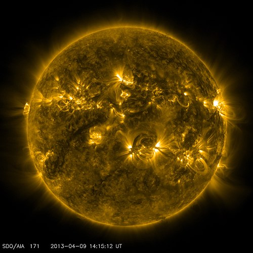

# RMHD with PINN 

#Table of contents.

## Architecture

Random. 

Some list
- like this
- like that
  
[This link](https://en.wikipedia.org/wiki/Magnetohydrodynamics)

[Here is a google drive link for the data](todo)

