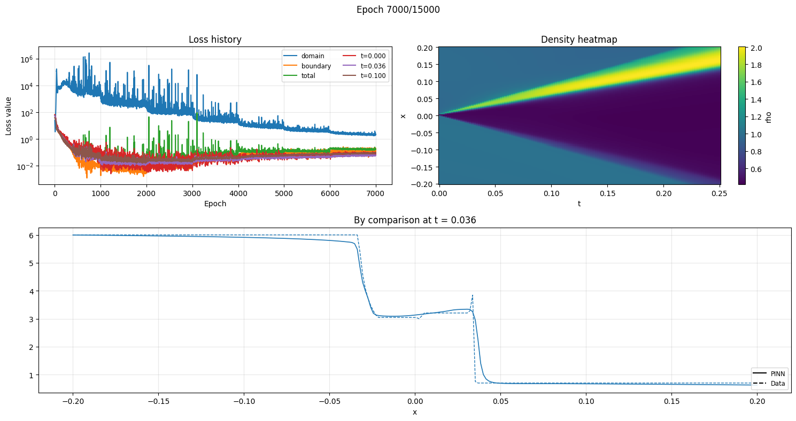
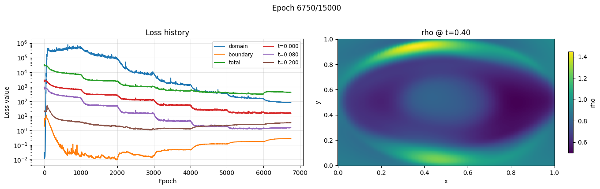
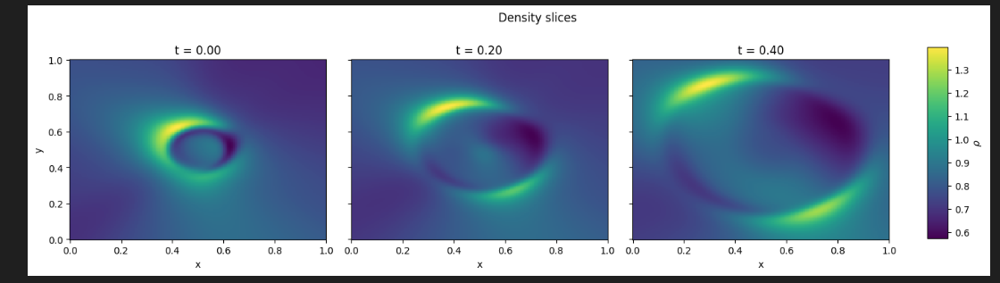
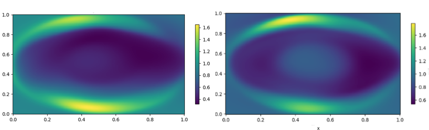
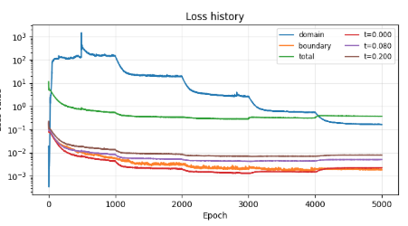
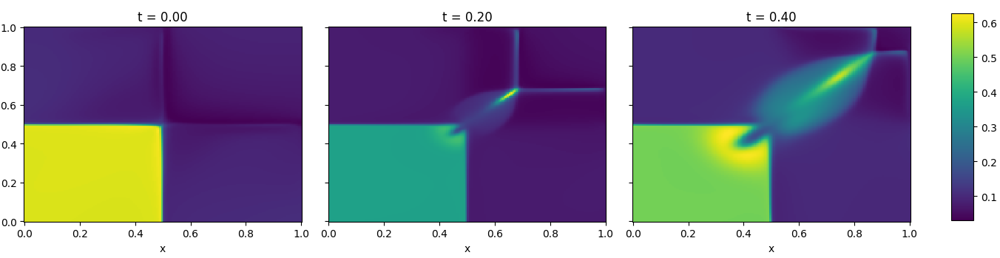
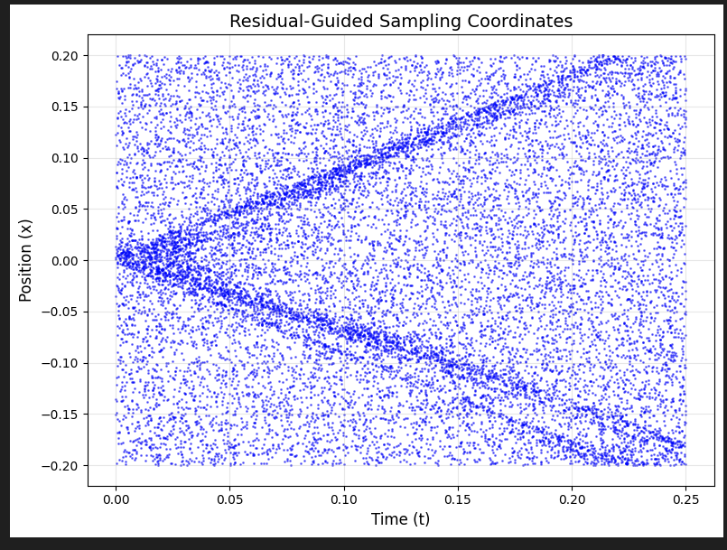

# Reconstructing RMHD from Physics Informed Neural Networks

A research code (`rmhdpinn.ipynb`) that implements physics-informed neural networks (PINNs) for relativistic magnetohydrodynamics (RMHD). Instead of advancing the standard conservative form, the workflow relies on Jacobians of the primitive-variable system (`M`, `AX`, source terms) to measure how well a neural surrogate satisfies the PDEs. The notebook first trains a baseline PINN, then iteratively learns residual-correction networks using stored Jacobian operators.

## Table of Contents
- [RMHD](#RMHD)
- [Overview](#overview)
- [Physics Background](#physics-background)
- [Notebook Workflow](#notebook-workflow)
- [Repository Structure](#repository-structure)
- [Installation](#installation)
- [Running the Notebook](#running-the-notebook)
- [Further Work](#further-work)
- [References](#references)

## RMHD

Relativistic magnetohydrodynamics (RMHD) describes the dynamics of a conducting fluid interacting with electromagnetic fields when bulk flow velocities approach the speed of light. It provides the appropriate effective theory for relativistic plasmas encountered in high-energy astrophysical environments such as black-hole accretion flows, relativistic jets, pulsar winds, and compact-object mergers. RMHD can be viewed as the special-relativistic limit of full general-relativistic MHD (GRMHD), retaining the essential coupling between fluid dynamics and magnetic fields while neglecting spacetime curvature.

Under the assumption of ideal MHD, which is when the electric field vanishes in the fluid rest frame,
the governing equations follow from local conservation of stress–energy and charge together with Maxwell’s equations. These assumptions yield a system of eight coupled, first-order hyperbolic partial differential equations for the primitive variables, supplemented by the elliptic divergence constraint on the magnetic field,
$$\partial_i B^i = 0$$

As in the full GRMHD setup, the governing equations follow from stress--energy conservation, current conservation, and Maxwell (We will further assume the ideal-MHD condition $F^{\mu\nu}u_\nu=0$). These form a first order coupled PDE system. For their numerical implementation, it is usually written in the conservative scheme:

$$ \partial_t U(P) + \partial_i J^i(P) = 0 $$ 

for functions of the primitives $P=(\rho_0,p_0,u^\mu,B^\mu)$. A numerical integrator would typically perform 

1) time step to update $U(P)$ (primitive function)
2) The numerical inversion $P=P(U)$, a trascendental function highly sensitive to the background
3) Evaluate the current divergence $\partial_i J^i(P)$ via finite differences or finite elements and repeat step 1.

For purposes of training we find it more convenient to expose the linear structure of the equation (*), by casting it as

$$ M \partial_t P + A^i \partial_i P = 0 $$ 

where the Jacobians $M=\partial U/\partial P$ and $A^i=\partial J^i/\partial P$ encode the characteristic structure. Indeed, linearizing around a homogeneous background $(\rho_0,p_0,u^\mu_0,B^\mu_0)$ yields a first-order system

$$ M \partial_t \delta P  + A^i \partial_i \delta P = 0$$ 

The eigenvalues of $M^{-1} A^i n_i$ give the wave speeds along direction $n_i$. For instance, Alfvén waves emerge as the transverse, incompressible characteristic family. In RMHD their propagation speed is

$$v_A^2 = \frac{b^2}{b^2 + h}$$

where $b^2$ is the magnetic-field energy density measured in the fluid frame and $h = \rho_0 + p_0 + \varepsilon_0$ is the relativistic enthalpy. Alfvén waves propagate strictly along magnetic field lines, are transversely polarized, and remain linearly degenerate, making them a key diagnostic of any RMHD surrogate. Accurately reproducing this characteristic structure is therefore a fundamental consistency requirement for the approach adopted here.


## Overview of our approach

The goal of this project is to approximate RMHD dynamics with a continuous neural surrogate that respects the governing equations at the level of their primitive-variable Jacobians. The physics-informed neural network (PINN) represents a direct map from spacetime coordinates to the primitive variables,

$$x^\mu \to NN(x)=P=(\rho_0,p_0,u^\mu,B^\mu)$$.

Rather than advancing the solution through discrete time stepping, the network is trained so that its output satisfies the RMHD equations throughout spacetime. This is achieved by minimizing a composite loss function that combines physical constraints with data supervision. The total loss is written schematically as

$$\mathcal{L}_{\textrm{total}} = w_1 \mathcal{L}_{\textrm{PDE}} + w_2 \mathcal{L}_{\textrm{data}} + w_3 \mathcal{L}_{\textrm{bdy}}$$

The individual loss components are:
1. **PDE loss** $\mathcal{L}_{\mathrm{PDE}}$: the squared residual of the RMHD equations written in Jacobian form evaluated at randomly sampled collocation points in spacetime. The divergence-free constraint $\partial_i B^i = 0$ is enforced as an additional spatial equation within this term.
2. **Data loss** $\mathcal{L}_{\mathrm{data}}$: an $L^2$ loss fitting early-time simulation snapshots supplied in the `data1D` and `data2D` directories, including the initial condition at $t=0$.
3. **Boundary loss** $\mathcal{L}_{\mathrm{bdy}}$: a penalty enforcing open boundary conditions by requiring that the primitive variables at the domain boundaries remain constant in time.

Training proceeds in stages. In the early phase, the network is guided primarily by simulation data to ensure convergence toward the physically relevant solution manifold. As training progresses, the weight of the PDE residual is increased while the influence of data supervision is gradually reduced. This allows the PINN to extrapolate the solution to later times using only the governing RMHD equations. Additional correction networks can then be trained using residual-guided sampling to systematically reduce remaining PDE violations, yielding increasingly accurate RMHD surrogates.

See [1] for more details about physically informed networks.

## Architecture and training

The architecture is a standard MLP with different sizes for tests in one and two dimensions. In 1D we use approximately 64 layers of width 32. In 2D we use approximately 64 layers of width 128. Activations are set as trainable hyperbolic tangent. 

A key ingredient to improve convergence of the PDE loss is the implementation of MUON optimizer [2]. MUON allows for rapid training of the previously simulated data during the first ~1000 epochs. We then gradually increase the PDE weight for around ~10000 epochs. *The data is only inocorporated through two snapshots at early times*.  On the other hand, the sampling proceeds by increments of ~500 samples from the domain every 1000 epochs, while data sampling is decreased accordingly. 

A typical training process for 1d will look as follows:




Here the data is supplied at early times `t = 0.0, 0.036, 0.1`. The network provides an accurate extrapolawtion of the shockwave 1d process. This is true even at late times where no data is provided. 

### 2d Cylindrical explosion test

For 2d and the above described network we test a cylindrical explosion process.



Below we quote representative plots for the density at three different times. The mesh is cut off at t=0.4 due to our estimation that the magnetosonic wave reaches the boundary at $x=0,1$, thus the open boundary conditions cease to be consistent.



A crucial ingredient in this test is the augmentation of the PDE system by an extra spatial constraing, the divergence free condition

$\partial_i B^i =  0 $ 

which is imposed by the PDE but often violated in time evolution. The correction resolves the internal shock in the explostion test. See below for comparison.


<p align="center"></p>

### 2d Shocktube test

Another test involves the generation of a 2d shock in relativistic hydrodynamics. This simpler setup leads to rapid convergence and sharp resolution.

<p align="center"></p>



Crucially the network architecture, scheduler and learning rate are kept precisely as in the cylinder test. We have chosen to use the same network rather than optimizing the hyperparameters to illustrate the versatility of the PINN.

## Optional: Residual Network

Once the model has finished training we can evaluate the domain residual at random points. We model a new density of samples according to such residual. For instance in the 1D shocktube we will obtain:




With such samples we can train successive "residual" networks (`model_residual`) that learn to cancel the PDE violations of the latest solution (`model`). 

At each collocation point we evaluate a new network for the state $\delta\mathbf{p}(x,t)$. This is an Alfven-like perturbation of the system and sastisfies the linearized PDE

$$
M(\mathbf{p}) \partial_t \delta\mathbf{p} + A_x(\mathbf{p}) \partial_x \delta\mathbf{p} + S(\mathbf{p}) \delta\mathbf{p} = \mathcal{R}(\mathbf{p}) ,
$$

where $M$ is the time Jacobian, $A_x$ is the spatial Jacobian, and $S = \partial_t M + \partial_x A_x$ in the background $p$. Recall that during training we computed targets

$$
\mathcal{R}(\mathbf{p}) = M  \partial_t \mathbf{p}
      + A_{x} \partial_x \mathbf{p}
$$

so that we can now train the network for $\delta\mathbf{p}$ to minimize the difference between the above two equations, namely

$$
M(\mathbf{p}) (\partial_t \delta\mathbf{p} - \partial_t p) + A_x(\mathbf{p}) (\partial_x \delta\mathbf{p} - \partial_x p) + S(\mathbf{p}) \delta\mathbf{p} = 0
$$

This is so that the PINN $p - \delta p$ adheres to the Jacobian PDE.

## Repository Structure
```
RMHD-NN/
├── README.md                # Project overview and usage
├── RMHDEquations2D.py       # Reference RMHD equations (informative)
├── jacobians.py             # Computes M/AX Jacobians used in notebooks
├── rmhdpinn_1d.ipynb        # 1D PINN workflow
├── rmhdpinn_2d.ipynb        # 2D PINN workflow
├── images/                  # Documentation figures (README.md)
├── data1d/                  # 1D datasets
└── data2d/                  # 2D datasets
```

## Installation
- Python 3.10+ with `pip`
- PyTorch ≥ 2.0 (CPU, CUDA, or Apple MPS build)
- NumPy, Matplotlib, SciPy, tqdm, IPython, Muon optimizer dependency
- JupyterLab or VS Code notebooks
- RMHD snapshot files inside `data1d/`

Recommended setup (from the repo root):
```bash
python3 -m venv .venv
source .venv/bin/activate
pip install --upgrade pip
pip install torch numpy matplotlib scipy tqdm jupyter
pip install git+https://github.com/KellerJordan/Muon
```

## Usage
A good starting point for this project is the notebook `rmhdpinn_1d.ipynb` (and `rmhdpinn_2d.ipynb` for two dimensions).
A typical workflow is:

1. **Train a baseline PINN (`model`).**
   Uses the MUON optimizer together with domain, data, and boundary losses to learn a spacetime map to the RMHD primitive variables.

2. **Build Jacobian operators and evaluate residuals.**
   The RMHD Jacobians $(M, A^i)$ are constructed and the PDE residual is evaluated at sampled collocation points.

3. **Train residual-correction networks (`model_residual`).**
   Residual-guided sampling is used to train successive correction networks that reduce remaining PDE violations.

4. **Inspect convergence and diagnostics.**
   Plotting and evaluation cells compare baseline and corrected solutions and visualize extrapolation to later times.

Important note: before running the notebooks, set the adiabatic index `gamma` in `jacobians.py` to match the experiment. For the 1D shock setup use `gamma = 4/3`; for the 2D cases use `gamma = 5/3`.

Early-time simulation snapshots are loaded from `data1d/` and `data2d/`, while later-time behavior is learned solely from the governing RMHD equations. Running the notebook top-to-bottom with default settings reproduces the results shown in this repository.


## Further Work
- **More iterations:** Add additional correction stages by repeating the Jacobian-storage + residual-training pattern.
- **Higher dimensions:** Replace `jacobians.py` with a higher-dimensional RMHD Jacobian provider and adjust the sampler.
- **Hybrid losses:** Combine Jacobian residuals with conservative-form residuals for robustness.
- **Deployment:** Export trained models by scripting the inference calls (`model`, `corr`, `corr2`) and saving weights with `torch.save`.

Feel free to open issues or PRs if you adapt the notebook to new RMHD scenarios or improve the training strategy.

## Contact Information
**Corwin Cheung**  
Harvard College, Harvard John A. Paulson School of Engineering and Applied Sciences  
Email: `corwincheung       @college.harvard`  
ORCID: `https://orcid.org/0009-0009-7759-623X`

**Marcos Johnson-Noya**  
Harvard College, Harvard John A. Paulson School of Engineering and Applied Sciences  
Email: `mjohnsonnoya     @college.harvard`  
ORCID: `https://orcid.org/0009-0008-5084-3571`

**Michael Xiang**  
Harvard College, Harvard John A. Paulson School of Engineering and Applied Sciences  
Email: `michaelxiang    @college.harvard`  
ORCID: `https://orcid.org/0009-0000-9745-8146`

**Alfredo Guevara**  
Institute for Advanced Study  
Email: `aguevara  @ias`  
ORCID: `https://orcid.org/0000-0002-8963-6560`

**Dominic Chang**  
Email: `dominicchang      @fas.harvard`  
ORCID: `https://orcid.org/0000-0001-9939-5257`

## Acknowledgements

This project was partially funded through the Harvard College Research Program (HCRP). We further thank Harvard Research Computing (HRC) for availability of computing resources. We especially thank Richard Qiu for collaboration and guidance at the beginning stages of this project. We thank Mark Goldstein for suggesting the application of a MUON optimizer. Simulation of initial/early time data was done using the Black Hole Accretion Code (BHAC) [3].

## References
[1] Kharazmi, Zhang, Karniadakis (2020). Variational Physics-Informed Neural Networks. https://arxiv.org/abs/2001.04536

[2] Jordan (2024). Muon: An optimizer for the hidden layers of neural networks. https://kellerjordan.github.io/posts/muon/

[3] Porth, Olivares, Mizuno, et al (2017). The Black Hole Accretion Code. https://arxiv.org/abs/1611.09720
